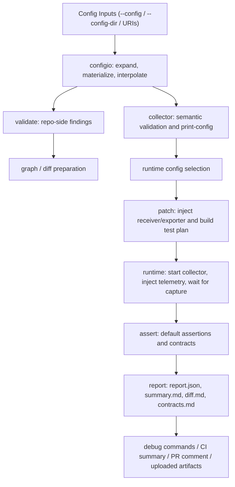

# System Architecture

## Summary

Meridian is organized as a Go CLI with explicit subsystems for config loading, semantic validation, graphing, diffing, patching, runtime execution, assertion evaluation, and reporting.

## End-to-end view

## Major subsystems

- `internal/app`: command definitions, option parsing, and orchestration entry points
- `internal/configio`: source expansion, materialization, YAML loading, env interpolation
- `internal/collector`: Collector-native semantic validation and effective-config resolution
- `internal/graph`: pipeline graph model generation
- `internal/diffing`: structural diff classification
- `internal/patch`: runtime config patching and test-plan generation
- `internal/runtime`: container execution, injection, capture wait, runtime adapters
- `internal/assert`: assertions, contract loading, and evaluation
- `internal/report`: markdown, terminal, diff, contract, and bundle rendering
- `internal/model`: shared types and artifact manifest definitions

## Architectural intent

Meridian is intentionally concrete. The implementation favors explicit stages over framework-heavy abstractions so that a failing run can usually be traced to one subsystem and one stage.
